# Alta Disponibilidad en IBM Cloud VPC con Terraform y Schematics

Despliegue de una arquitectura web de **alta disponibilidad** en IBM Cloud, totalmente automatizada con **Terraform** y gestionada como Infraestructura como Código a través de **IBM Cloud Schematics**.

Dos servidores Ubuntu ubicados en **zonas de disponibilidad distintas** (Washington DC, `us-east`), detrás de un **Application Load Balancer** público, con **políticas de backup** automáticas para sus volúmenes.

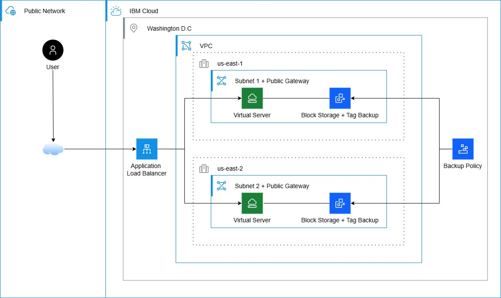

## ¿Qué demuestra este proyecto?

- **Infraestructura como Código (IaC)** real con Terraform, organizada en módulos reutilizables.
- **Alta disponibilidad** mediante distribución de carga en dos zonas de disponibilidad físicamente separadas.
- **Balanceo de carga** con health checks automáticos.
- **Resiliencia de datos** con políticas de backup programadas.
- **GitOps** usando IBM Cloud Schematics conectado a este repositorio.
- **Gestión del ciclo de vida** completo: plan, apply y destroy controlando costos.

## Arquitectura

| Componente | Detalle |
|---|---|
| Región | `us-east` (Washington DC) |
| VPC | 1 VPC con security group para las VSI (HTTP/HTTPS/SSH) |
| Subnets | 2 subnets, una en `us-east-1` y otra en `us-east-2` |
| Cómputo | 2 VSI Ubuntu 24.04, perfil `bx3dc-2x10` (balanced confidential computing) |
| Balanceador | Application Load Balancer público, round-robin, con su propio security group |
| Backup | Política con plan diario, retención de 7 días |

> **Total: 22 recursos.** El balanceador tiene un security group dedicado (separado del
> de las VSI) que permite el tráfico HTTP entrante desde internet. Esta separación entre
> el security group del LB y el de las máquinas es una buena práctica: el LB es la única
> superficie expuesta y las VSI quedan detrás.

## Estructura del repositorio

```
.
├── main.tf                  # Orquesta todos los módulos
├── variables.tf             # Variables de entrada
├── outputs.tf               # Salidas (hostname del LB, IPs, etc.)
├── versions.tf              # Versión de Terraform y provider IBM
├── terraform.tfvars.example # Plantilla de variables
├── modules/
│   ├── network/             # VPC, subnets, security group, gateways
│   ├── compute/             # Las 2 VSI con Nginx vía cloud-init
│   ├── loadbalancer/        # ALB, pool, listener y miembros
│   └── backup/              # Política y plan de backup
└── docs/
    ├── architecture.svg     # Diagrama
    └── SCREENSHOTS.md        # Guía de capturas
```

## Requisitos previos

- Una cuenta de IBM Cloud.
- Una **SSH key** ya creada en tu cuenta (VPC Infrastructure → SSH keys).
- Un **API key** de IBM Cloud (para ejecución local) o un workspace de Schematics.
- El plugin de Terraform para IBM Cloud (se instala solo con `terraform init`).

## Opción A — Desplegar con IBM Cloud Schematics (recomendado)

1. Sube este repositorio a tu cuenta de GitHub.
2. En IBM Cloud, ve a **Schematics → Workspaces → Create workspace**.
3. Pega la URL de tu repo de GitHub y selecciona la rama.
4. Elige la versión de Terraform (>= 1.5).
5. En la pestaña **Variables**, ajusta `ssh_key_name`, `region`, etc.
6. Pulsa **Generate plan** y revisa los recursos a crear.
7. Pulsa **Apply plan** y espera a que termine.
8. Copia el output `load_balancer_hostname` y ábrelo en el navegador.

> Schematics inyecta automáticamente las credenciales, así que **nunca** subas tu API key al repositorio.

## Paso a paso visual

A continuación, el despliegue real de este proyecto documentado con capturas.

**1. Crear la SSH key** en la región `us-east` (Infrastructure → Compute → SSH keys → Create).

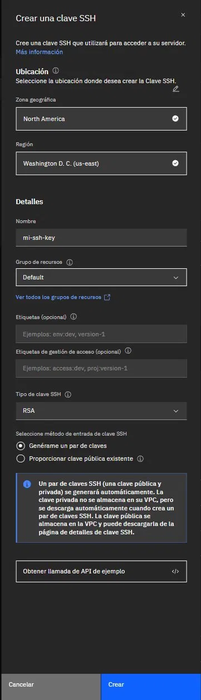

**2. La SSH key queda registrada** en tu cuenta, en la región correcta.

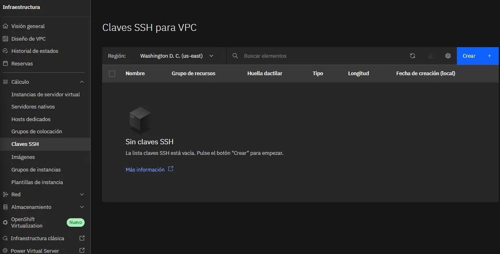

**3. Crear el workspace en Schematics** (Platform Automation → Schematics → Terraform → Create workspace), apuntando a este repositorio.

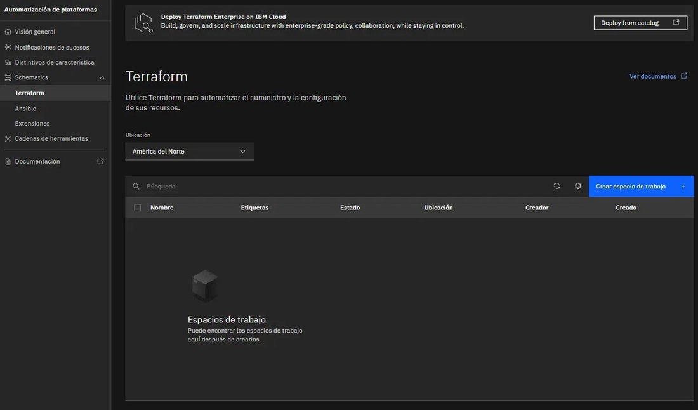

**4. Confirmar la configuración del workspace**: repositorio, versión de Terraform, nombre y región.

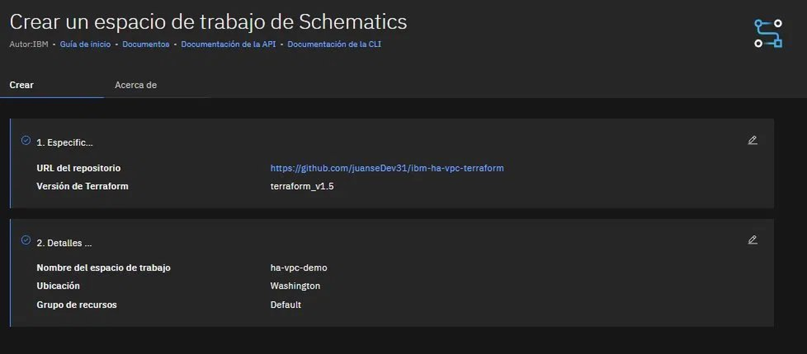

**5. El workspace detecta automáticamente las variables** del código Terraform, ya con sus valores por defecto.

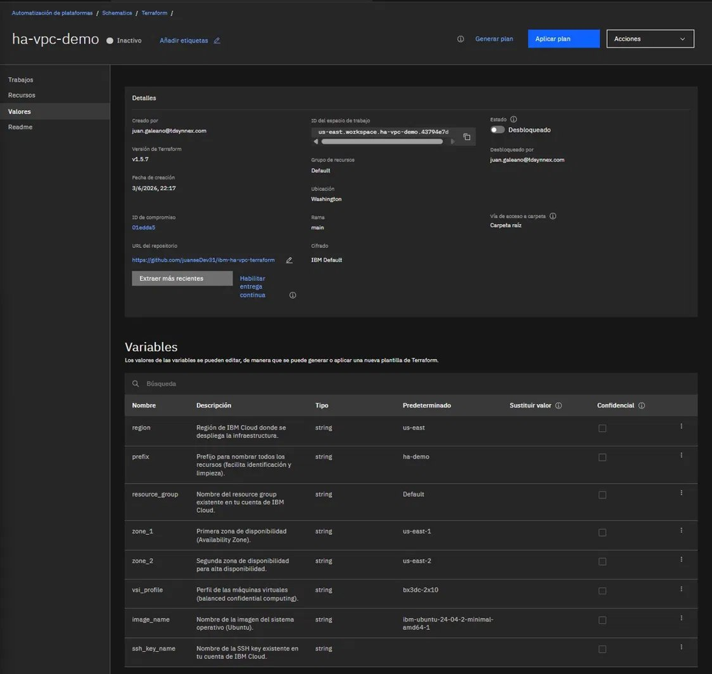

**6. Configurar la variable `ssh_key_name`** con el nombre de la SSH key creada.

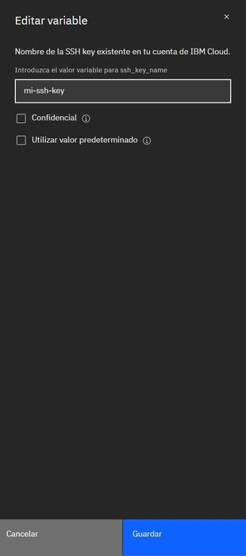

**7. Generar el plan**: Terraform valida y reporta los recursos a crear (el plan inicial mostró 19; tras añadir el security group dedicado del balanceador, el total final fue de 22).

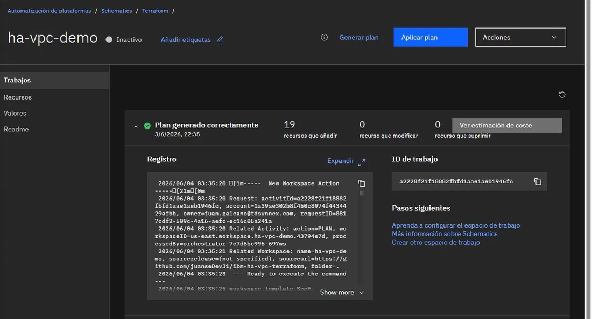

**8. Estimación de costo** antes de aplicar (los recursos se cobran por uso medido, no por el total mensual mostrado).

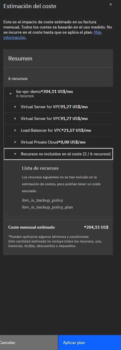

**9. Aplicar el plan**: Terraform crea los recursos en IBM Cloud y el workspace pasa a estado *Activo*.

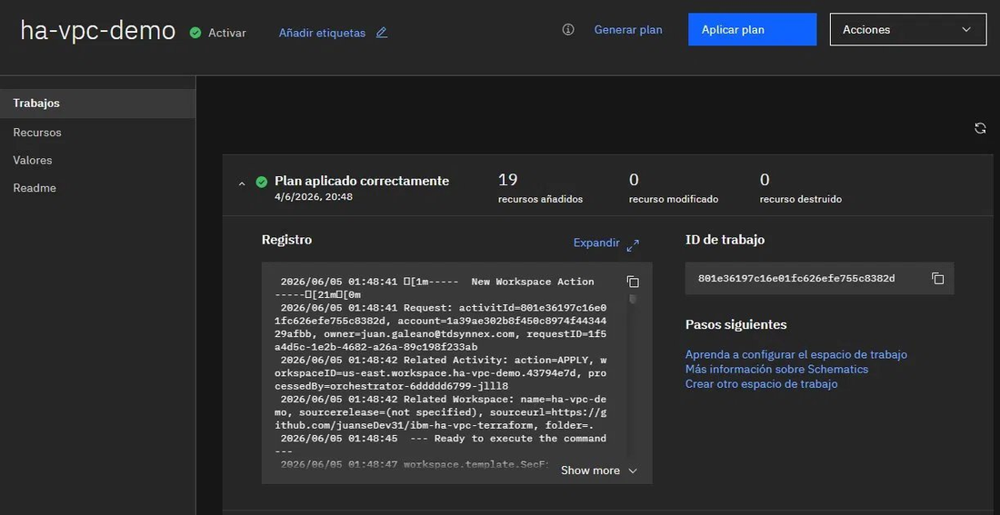

**10. La VPC** queda disponible con sus 2 subnets.

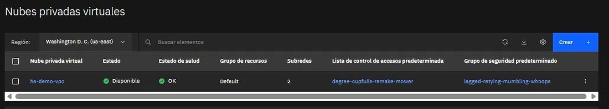

**11. Las dos máquinas virtuales** corriendo, una en cada zona (`10.241.0.4` en us-east-1 y `10.241.64.4` en us-east-2).

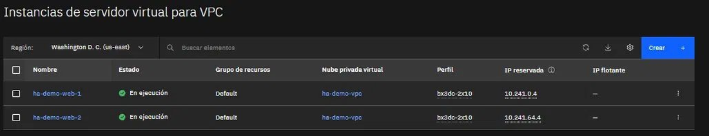

**12. El Application Load Balancer** activo y público.

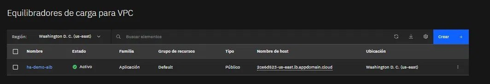

**13. La política de backup** aplicada a los volúmenes (seleccionados por el tag `backup-policy:daily`).

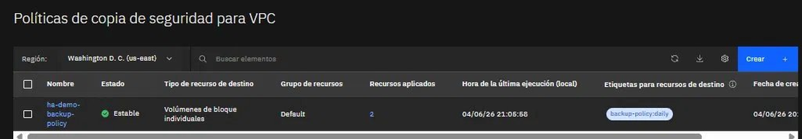

**14. Verificación del balanceo**: al acceder al hostname del balanceador, el tráfico se reparte entre las dos máquinas en zonas distintas.

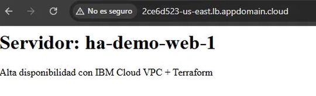 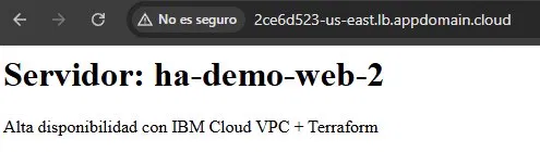

**15. Destruir los recursos** al terminar (Acciones → Destruir recursos) para controlar el costo.

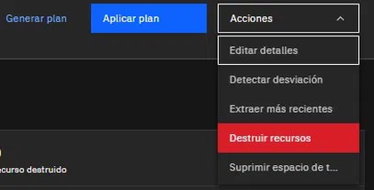

**16. Destrucción completada**: los 22 recursos eliminados, cerrando el ciclo de vida completo.

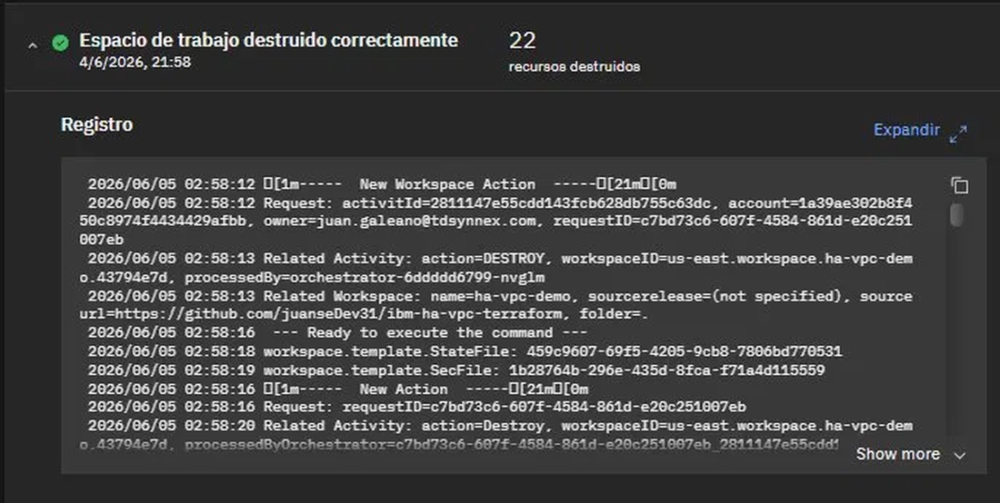

## Opción B — Desplegar en local

```bash
# 1. Exporta tu API key
export IC_API_KEY="tu_api_key_de_ibm_cloud"

# 2. Copia y ajusta las variables
cp terraform.tfvars.example terraform.tfvars
# edita terraform.tfvars con tu ssh_key_name

# 3. Inicializa, revisa y aplica
terraform init
terraform plan
terraform apply

# 4. Cuando termines de documentar, destruye todo para no generar costos
terraform destroy
```

## Cómo verificar el balanceo de carga

Abre en el navegador el hostname del Load Balancer (output `load_balancer_hostname`).
Verás una página que muestra el nombre del servidor que respondió. Al recargar varias
veces, el nombre alterna entre `ha-demo-web-1` y `ha-demo-web-2`: eso confirma que el
tráfico se distribuye entre ambas zonas.

## Nota sobre costos

Las VSI, el Load Balancer y los backups **se cobran por uso** y no entran en la capa
gratuita. La recomendación es escribir y validar todo el código (gratis), levantar la
infraestructura solo para tomar las capturas, y ejecutar `terraform destroy`
inmediatamente después. Así el costo total se reduce a unos pocos centavos.

## Limpieza

```bash
terraform destroy
```

O desde Schematics: **Actions → Destroy resources**.

## Licencia

MIT — úsalo libremente como base para tus propios proyectos.
